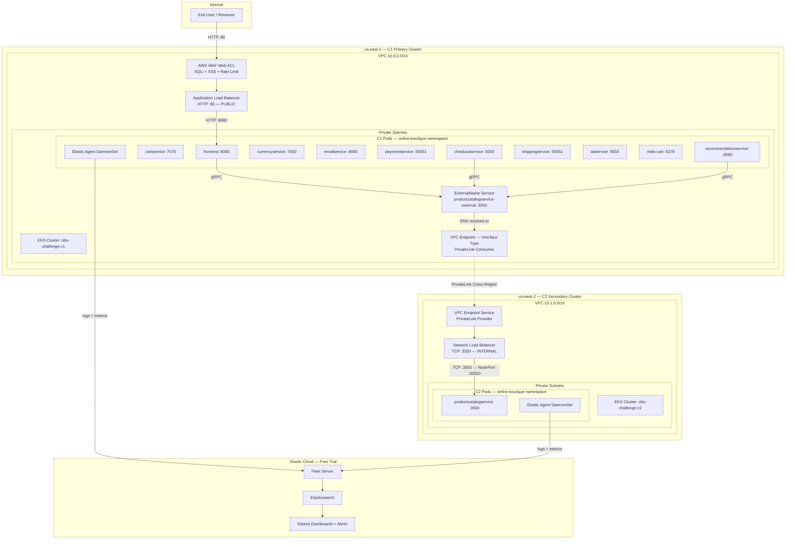

# Architecture Diagram

## High-Level Architecture



## Network Flow: Cross-Cluster gRPC Request

```
User → ALB (:80) → frontend (:8080) → ExternalName Service
  → VPC Endpoint DNS → PrivateLink (cross-region, private)
  → NLB (:3550) → NodePort (:30550) → productcatalogservice (:3550)
  → Response returns same path
```

## Service Mapping

| Service | Cluster | Region | Port | Notes |
|---------|---------|--------|------|-------|
| frontend | C1 | us-east-1 | 8080 | Public via ALB+WAF |
| cartservice | C1 | us-east-1 | 7070 | Internal only |
| checkoutservice | C1 | us-east-1 | 5050 | Calls productcatalog via PrivateLink |
| currencyservice | C1 | us-east-1 | 7000 | Internal only |
| emailservice | C1 | us-east-1 | 8080 | Internal only |
| paymentservice | C1 | us-east-1 | 50051 | Internal only |
| recommendationservice | C1 | us-east-1 | 8080 | Calls productcatalog via PrivateLink |
| shippingservice | C1 | us-east-1 | 50051 | Internal only |
| adservice | C1 | us-east-1 | 9555 | Internal only |
| redis-cart | C1 | us-east-1 | 6379 | Internal only |
| productcatalogservice | C2 | us-west-2 | 3550 | Isolated in C2, exposed via PrivateLink |

## Security Boundaries

- **Public**: Only ALB has a public endpoint (port 80)
- **Private**: All EKS nodes, NLB, VPC Endpoint — no public IPs
- **WAF**: SQLi, XSS, rate limiting (1000 req/5min) in BLOCK mode
- **PrivateLink**: Unidirectional, service-oriented — C1 can reach C2, not vice versa
- **Security Groups**: Least-privilege, SG-to-SG references where possible
